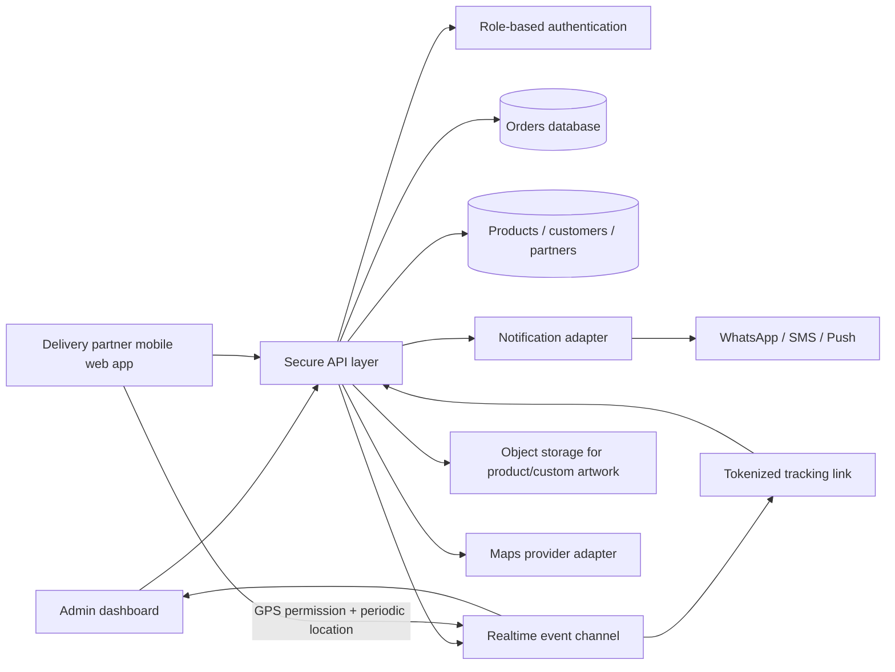

# MR AN CREATIVITY — Order Studio

A production-oriented architecture blueprint and frontend foundation for custom resin jewellery order operations.

## Architecture overview

## Current implementation

- `index.html`: responsive MR AN CREATIVITY admin workspace with dashboard, order lifecycle, order creation, partner management, products, customers, history and Leaflet live-tracking map.
- `delivery.html`: reserved route for the delivery-partner PWA (use the same API contracts and role guard).
- `track.html`: reserved public, tokenized customer tracking route.
- Local persistence is provided as a working prototype fallback through `localStorage`; replace the `db` adapter with the API client before production.

## Recommended production services

- Authentication: short-lived access tokens + rotating refresh tokens, Argon2id passwords, RBAC (`ADMIN`, `PARTNER`), and token-scoped customer tracking.
- Database: PostgreSQL with `orders`, `order_events`, `customers`, `products`, `delivery_partners`, `location_updates`, and `notification_jobs` tables.
- Realtime: WebSocket/SSE channel scoped to order IDs. Never publish a rider's location outside an active delivery.
- GPS: `navigator.geolocation.watchPosition` only after an explicit Start Delivery action; stop the watcher on Delivered, logout, or permission revoke.
- Maps: keep provider keys server-side where possible and use a provider adapter so Google Maps/Mapbox can be added without changing UI code.
- Notifications: queue status events and add WhatsApp/SMS/push adapters with retries and idempotency keys.

## Order state machine

`ORDER_PLACED → CONFIRMED → PREPARING → READY → PICKED_UP → OUT_FOR_DELIVERY → DELIVERED`; any non-terminal state may transition to `CANCELLED` with an audit event.

## Security and privacy checklist

1. Validate every status transition server-side and record actor, timestamp, and reason.
2. Use opaque, expiring tracking tokens; expose only first name, order summary, status and approximate location.
3. Encrypt sensitive data at rest, rate-limit login and tracking endpoints, and validate GPS payloads.
4. Retain precise location only for the configured delivery-retention window; show last-update time and stale state.
5. Add CSRF protection for cookie sessions, strict CORS, CSP, structured logs, backups and monitoring before launch.
